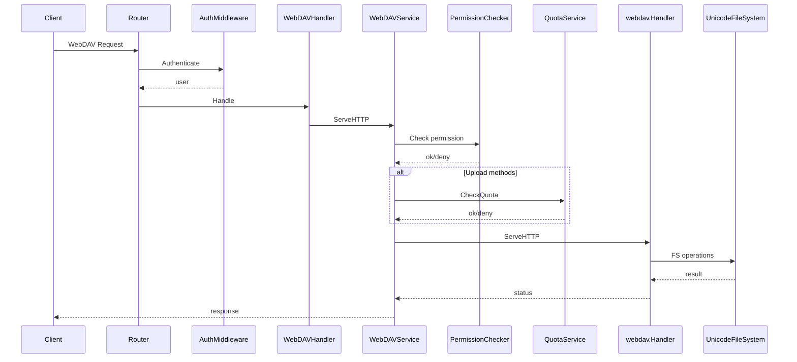
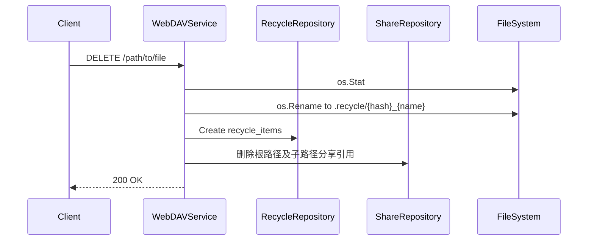

# WebDAV 请求处理流程

本文档只描述“单次 WebDAV 请求进入服务端后，会经过哪些校验与文件系统操作”。

## 文档边界

以下内容不在本文重复展开：

- 服务整体模块划分、容器初始化、路由装配：见 [仓库架构V1.md](./仓库架构V1.md)
- 认证方式、UCAN、访问密钥、管理员能力：见 [认证设计.md](./认证设计.md)
- 回收站对外 API、分享接口：见 [Warehouse OpenAPI](./openapi/README.md)

## 处理链路总览

## 关键步骤说明

1. **认证**：通过 `AuthMiddleware` 获取用户信息，未授权直接拒绝。
2. **忽略系统文件**：对 `.DS_Store` / `.AppleDouble` / `Thumbs.db` / `._*` 等特殊路径返回 404/204。
3. **用户目录解析**：
   - `user.Directory` 为绝对路径时直接使用
   - 否则拼接为 `webdav.directory + user.Directory`
   - 若未设置 `user.Directory`，回退到 `webdav.directory`
   - 权限校验时使用 `user.Directory` 或 `user.Username` 作为逻辑前缀来组装路径
4. **权限校验**：将 HTTP 方法映射为权限操作（C/R/U/D），使用用户规则或默认权限判断。
5. **配额校验**：
   - 对 `PUT/POST` 新建文件按完整大小检查
   - 对 `PUT/POST` 覆盖已有文件按大小增量检查
   - 对文件 `COPY` 按源文件与目标已有文件的大小增量检查
   - 对目录 `COPY` 按源目录相对文件逐个抵扣目标同路径文件大小
   - `MKCOL` 不增加逻辑容量，因此不产生额外 quota 压力
6. **WebDAV 处理**：
   - 使用自定义 `UnicodeFileSystem`，确保 Unicode 路径正确处理
   - 使用内存锁 `webdav.NewMemLS()`
7. **删除行为**：`DELETE` 默认移动到回收站目录 `.recycle` 并记录数据库；apps 下 `backup.__sync_*` 系统运行态对象直接硬删除。
8. **用量更新**：对主写路径成功操作按 delta 更新 `used_space`；回收站永久删除 / 清空回收站时释放对应额度。

## WebDAV 方法与权限映射

- `GET/HEAD/OPTIONS/PROPFIND` → Read (`R`)
- `PUT` → 目标不存在时 Create (`C`)，目标已存在时 Write (`U`)
- `PATCH/PROPPATCH` → Write (`U`)
- `POST/MKCOL` → Create (`C`)
- `COPY/MOVE` → Write (`U`)
- `DELETE` → Delete (`D`)
- 其他方法默认映射为 Read

权限匹配逻辑：

1. 若路径命中 `user_rules`，使用规则权限。
2. 否则使用 `users.permissions` 默认权限。

更完整的权限模型与认证边界，见 [认证设计.md](./认证设计.md)。

## DELETE 回收站流程

- 若移动失败，会回退为直接删除。
- 回收站文件命名规则：`{hash}_{原文件名}`。
- 删除到回收站后，定向分享、公开链接和派生公开链接立即失效；恢复资源不会自动恢复分享。
- apps 下 `backup.__sync_mutex_v1.__sync_lock_v1`、`backup.__sync_txn_head_v1*.json` 和 `backup.__sync_txn_data_v1.*.json` 属于系统同步运行态对象，删除时不进入回收站；历史误入 `.recycle` 的记录使用 `warehouse recycle clean-sync-artifacts` 清理。

## MOVE/COPY 目的路径规范化

对 `Destination` Header 做解码和规范化，避免代理或编码导致的路径异常。

- `MOVE` 成功后，服务端同步迁移根资源及子路径的定向分享、公开链接和派生公开链接。
- `COPY` 保留源路径分享关系，新副本不自动继承分享。
