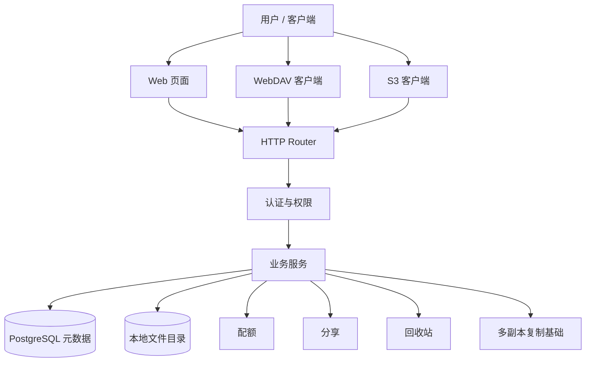
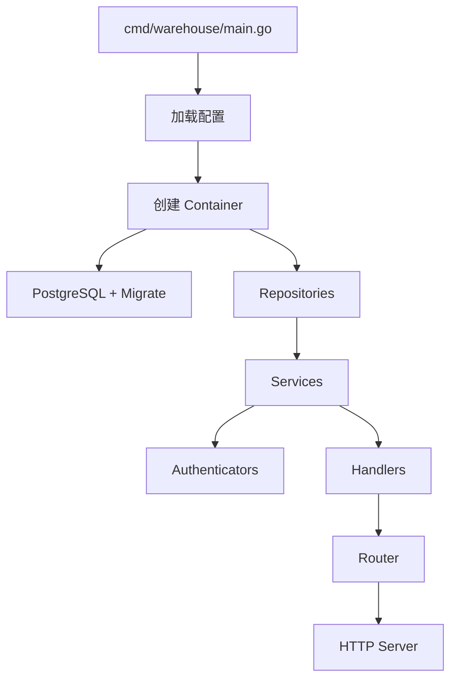
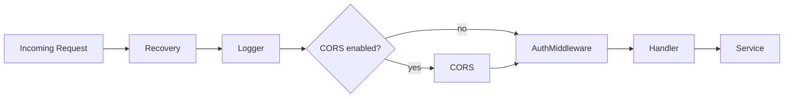
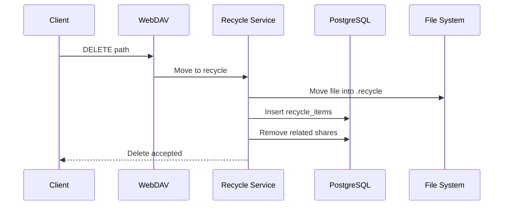

# 仓库架构 V1

本文只描述 Warehouse V1 已经实现的基础架构事实。V2 已实现的自愈、观测、限流和运维治理见 [仓库架构V2.md](./仓库架构V2.md)，未实现的自动编排和正式多副本见 [仓库架构V3.md](./仓库架构V3.md)。

## 面向人群

| 人群 | 阅读重点 |
| --- | --- |
| 新接手研发 | 模块边界、请求链路、当前能力边界 |
| 运维 / SRE | 当前部署形态、复制边界、回收站与数据恢复关系 |
| 产品 / 负责人 | 当前已落地能力，不把规划当现状 |
| 协议 / 集成方 | WebDAV、S3、JSON API 的接入位置和能力边界 |

## V1 范围

| 范围 | 当前实现 |
| --- | --- |
| 对外入口 | Web 页面、JSON API、WebDAV、S3 兼容接口 |
| 元数据 | PostgreSQL |
| 文件内容 | 本地 `webdav.directory` |
| 认证 | Basic、Web3/JWT、UCAN、访问密钥 |
| 资产空间 | `personal`、`apps`、`services` |
| 分享 | 公开分享、站内共享、分组共享、全员共享 |
| 回收站 | WebDAV 删除进入 `.recycle`，支持恢复、永久删除和清空 |
| 配额 | 用户级容量规则、写入校验、后台对账 |
| 高可用基础 | `1 active + N standby`，standby 通过 internal 复制追随 |

## 总体结构

## 模块划分

| 模块 | 职责 |
| --- | --- |
| `cmd/warehouse` | 进程入口，解析参数、加载配置、启动服务 |
| `internal/container` | 依赖装配和生命周期管理 |
| `internal/interface/http` | HTTP 路由、中间件、API/WebDAV Handler |
| `internal/application/service` | WebDAV、分享、回收站、配额等业务服务 |
| `internal/domain` | 用户、权限、分享、回收站等领域规则 |
| `internal/infrastructure` | 数据库、配置、认证、日志等基础设施 |
| `internal/infrastructure/webdav` | 自定义 WebDAV 文件系统适配 |

## 启动流程

启动校验重点：

- `web3.jwt_secret` 必填且长度至少 32。
- `database.type` 仅支持 `postgres` / `postgresql`。
- `webdav.directory` 必须存在或可创建。

## 请求链路

WebDAV 单次请求的权限、配额、回收站、MOVE/COPY 细节见 [WebDAV请求处理流程.md](./WebDAV请求处理流程.md)。

## 当前能力

### 资产空间

用户登录后资产分为三类：

- 个人资产：用户主动上传和管理。
- 应用资产：DApp / 前端应用按 appId 隔离写入。
- 服务资产：后台服务、定时任务和自动化产物。

详细路径和权限边界见 [资产空间分层方案.md](./资产空间分层方案.md)。

### 分享

当前有两条分享线：

- 公开分享：面向匿名或站外访问，当前主要用于文件外链。
- 站内共享：面向已登录用户，支持文件、目录、权限位、单用户、分组和全员受众。

共享的产品模型和演进细节见 [共享方案.md](./共享方案.md)。

### 回收站

回收站的当前实现如下，详细设计与运行边界见 [回收站方案.md](./回收站方案.md)：

- WebDAV 删除会把文件移动到 `.recycle` 目录。
- 同时写入 `recycle_items`，记录 hash、路径、大小和删除时间。
- 资源离开有效资产路径后，对应站内共享和公开链接立即删除。
- `recover` 将文件恢复到原路径，若原路径已存在则失败。
- `permanent` 永久删除回收站文件并移除记录。
- `clear` 批量清空回收站。
- 恢复资源不会自动恢复删除前的分享关系。

### 多副本基础

V1 已经具备 `1 active + N standby` 的复制基础：

- active 对外承接用户流量。
- standby 不接用户流量，只接 internal 复制流量。
- 每个实例各自使用本地 `webdav.directory`。
- 元数据以 PostgreSQL 为准。
- active 通过 outbox 和 reconcile 将文件变更同步到 standby。

完整多副本设计见 [多副本方案.md](./多副本方案.md)。

## V1 不包含

以下能力不要在 V1 文档里描述成已实现：

- 自动 failover / promote。
- 自动 rebalance。
- 完整周期性全量对账和漂移修复。
- 多 active 同时承接写流量。
- 共享 POSIX 存储或对象存储化后的无状态副本。
- Agent Run、Context Manifest、Artifact Provenance 等 Knowledge 上层业务语义。

其中 reconcile 自愈和运维治理已由 [仓库架构V2.md](./仓库架构V2.md) 实现；自动 failover、正式多副本和上层 Knowledge 控制面仍属于 [仓库架构V3.md](./仓库架构V3.md) 或后续版本。
