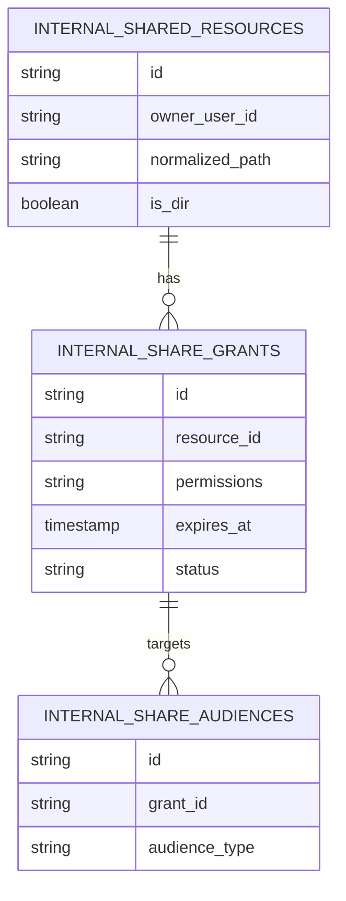

# 仓库架构 V3

本文记录 V2 冻结后继续推进的平台化能力。V3 的目标不是重复 V2 自愈和运维基础，而是把 Warehouse 从“可靠的社区资产底座”推进到“可横向扩展、可自动运维的存储平台”。

当前实现基线由 [仓库架构V1.md](./仓库架构V1.md) 和 [仓库架构V2.md](./仓库架构V2.md) 共同描述。

## V3 定位

V3 的核心目标是：

> 证明 Warehouse 可以在多副本、多实例和更高规模下稳定运行，并具备更完整的平台化治理能力。

V3 应建立在 V2 已完成的前提上：

- Knowledge 数据源与反馈资产边界已经稳定。
- `1 active + N standby` 的 reconcile、自愈、观测和限流已经稳定。
- quota 运维基础版已经可用。
- 系统对象生命周期治理已经收敛。

## V3 目标

| 方向 | V3 目标 |
| --- | --- |
| 正式多副本 | 从 active/standby 容灾形态演进到正式多实例服务形态 |
| 状态外置 | 消除关键临时状态的进程内依赖，为多应用副本接流量做准备 |
| 自动编排 | 补齐 failover、promote、rebalance、drain、release 的自动化边界 |
| 运维平台化 | 用统一 CLI / 状态接口降低人工 SQL、脚本和经验判断 |
| 共享治理 | 从“一次分享一条列表”收敛为“一个资源、多条授权”的协作资源模型 |
| 额度产品化 | 在 V2 运维基础上推进更完整的额度申请、审批、多主体和 reservation 能力 |
| 性能扩展 | 面向大文件、大目录、大规模 reconcile 做流式化和背压优化 |

## V3 候选能力

### 正式多副本 / 无状态应用副本

正式多副本不应依赖“每个副本都有自己的本地文件目录并同时接用户写流量”。推荐方向是：

- 共享 PostgreSQL。
- 共享 POSIX 文件存储，或进一步抽象到对象存储。
- 外置临时状态层。
- 2~N 个应用副本可滚动发布。
- LB 可转发到任意健康副本。

验收标准：

- 任意健康应用副本都可以接普通读写流量。
- 单应用副本重启、滚动发布或摘除不影响用户主链路。
- 文件系统、数据库和临时状态有明确一致性边界。

### 状态外置

当前 WebDAV 锁、challenge、邮箱验证码等临时状态仍有进程内依赖。V3 需要系统性评估并外置：

- WebDAV lock。
- 钱包 challenge。
- 邮箱验证码。
- 上传会话、分片会话等临时状态。
- 其他依赖进程内内存的请求状态。

验收标准：

- 多应用副本同时接流量时，临时状态不会因请求落到不同实例而丢失。
- 滚动发布不会中断已建立但仍有效的关键临时状态。

### 自动 Failover 与多 Standby 编排

V2 只要求观测、SOP 和人工可操作。V3 再推进自动化编排：

- 自动 failover / promote 的前置检查和执行流程。
- rebalance / drain / release 的编排规则与保护策略。
- promote / 回切 SOP 的自动化边界。
- 单 standby 异常时的自动隔离、恢复和重新加入。

验收标准：

- 自动化动作有明确前置检查、审计记录和回滚路径。
- 自动化不会在状态不明时扩大故障面。

### 运维 CLI 与状态接口平台化

V3 可以把 V2 的观测能力收敛成统一入口：

- `warehouse ha assignments status` 增强筛选与详情输出。
- `warehouse ha assignments rebalance`。
- `warehouse ha assignments promote` / 切换辅助命令。
- reconcile / bootstrap / assignment / generation 的统一观察入口。
- quota 对账、generation 清理、系统对象清理的统一运维入口。

验收标准：

- 常见运维动作不需要人工 SQL。
- CLI 输出能解释状态含义、风险和下一步建议。

### 平台化共享资源与授权治理

V2 的站内共享以 `internal_share_items + internal_share_audiences` 表示“一次分享”。这使单次分享可以包含多个受众，但同一 owner 重复分享同一路径时，接收端仍会看到多行“分享记录”。

V3 将站内共享演进为三层模型：



- **共享资源** 表示同一 owner 下的同一个路径对象，资源身份由 `(owner_user_id, normalized_path, is_dir)` 确定，不能仅按 name 或 path 聚合。
- **授权** 表示一套权限、有效期和状态；同一资源可同时存在“研发组可编辑”和“审计组仅读 30 天”等不同策略。
- **受众** 仍支持用户、分组和全员，但返回和操作时从属于具体 grant。

接收端列表按共享资源聚合，一个目录/文件只显示一行，并显示“ N 个有效授权”和授权来源概要。详情页再展开 grant 列表。不同 owner 的同名资源必须保持独立行，不做按名称去重。

权限判定不能只依赖列表上的权限并集：任一读、写、删除请求都必须由后端按 resource 解析当前用户的有效 grants，只要存在一条为该动作授权的 grant 才允许执行。

迁移以下列顺序进行：

1. 创建 `internal_shared_resources` 和 `internal_share_grants`，并将现有 `internal_share_items` 回填为 grant。
2. 按 `(owner_user_id, normalized_path, is_dir)` 生成资源，同资源的历史 share item 挂载到对应 grant。
3. 将 audience 外键从旧 share ID 切换到 grant ID，保持用户/分组/全员语义不变。
4. 使接收列表、详情、共享目录浏览和所有可写操作切到 resource + effective grant 授权。
5. 双读旧新模型并完成回归测试后，再移除旧的路由和表依赖。

服务启动会在 schema migration 后、开始接流量前自动执行带 PostgreSQL advisory lock 的 V3 回填和核对；共享上传会话已切换为按 V3 effective grant 执行 create/update 判定，其他共享读写入口仍待逐步迁移。以下 CLI 仍用于预演、人工复核和故障排查：

```bash
warehouse share backfill-resources -c config.yaml --dry-run
warehouse share backfill-resources -c config.yaml
warehouse share verify-resources -c config.yaml
warehouse share backfill-audiences -c config.yaml --dry-run
warehouse share backfill-audiences -c config.yaml
warehouse share verify-audiences -c config.yaml
```

回填可安全重复执行：资源由规范化身份的唯一约束收敛，每个历史 `internal_share_items.id` 至多对应一个 grant。

详细交互、索引、兼容与接口设计见 [共享方案.md](./共享方案.md)。

验收标准：

- 同一 owner 的同一资源在“分享给我的”列表中只显示一行。
- 不同 owner 的同名资源不会被错误合并。
- 不同权限、不同有效期的 grants 可共存，不彼此覆盖。
- 对资源的每种操作都由后端按有效 grant 复查，不因聚合展示产生越权。
- 历史分享、分组动态授权、多副本下的共享修改均保持可用。

### Quota 产品化与多主体额度

V2 只做运维基础版。V3 再考虑完整产品化：

- 使用率预警，例如 80% 提醒、90% 强提醒、100% 拒绝新增写入。
- 用户自助申请扩容，管理员审批。
- 应用 / 服务 / 组织等多主体额度。
- 更完整的逻辑文件元数据表。
- 高并发上传下的额度 reservation：预占用、成功提交、失败回滚。
- 套餐/计费系统的接口预留。

验收标准：

- 用户和管理员都能理解当前额度状态、申请路径和审批结果。
- 多主体额度不会破坏当前用户级 quota 规则。
- 高并发上传不会因为 quota 竞态造成明显超额或误拒绝。

### 大文件与性能优化

在 V2 冻结基线上，再推进更深的性能优化：

- 大文件流式 reconcile。
- 复制批量大小自适应。
- 带宽限流与背压。
- 单文件重复校验与跳过优化。
- 大目录遍历、COPY、对账和回收站清理的性能优化。

验收标准：

- 大文件和大目录场景不再依赖长时间阻塞式扫描或传输。
- active 正常读写流量优先级高于后台补历史和对账任务。

## V3 不做

以下能力不应因为 V3 平台化而进入 Warehouse：

- Agent Run 控制面。
- Context Manifest 业务语义。
- Service Principal 业务生命周期。
- Artifact Provenance 业务模型。
- 向量数据库、RAG 检索、agent memory。

这些能力属于 Knowledge、Agent 或其他上层系统。Warehouse 只提供可靠资产存储、协议接入、权限、checksum、配额、复制和可验证元数据。

## V3 启动条件

只有满足以下条件，才适合启动 V3：

1. V2 的 Knowledge 数据源与反馈资产边界已经被真实集成验证。
2. 复制自愈、观测、限流和 generation 清理已经稳定运行。
3. 当前生产主要风险从“单链路不稳定”转向“需要横向扩展和自动运维”。
4. 有明确需求证明多应用副本接流量、状态外置或自动 failover 的收益高于复杂度。
