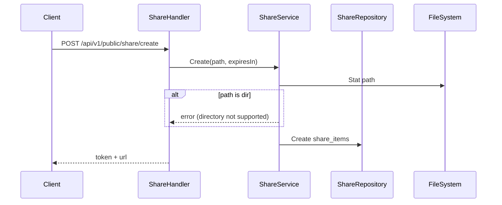
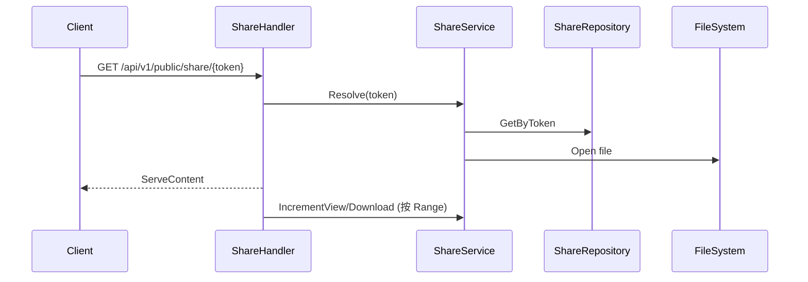
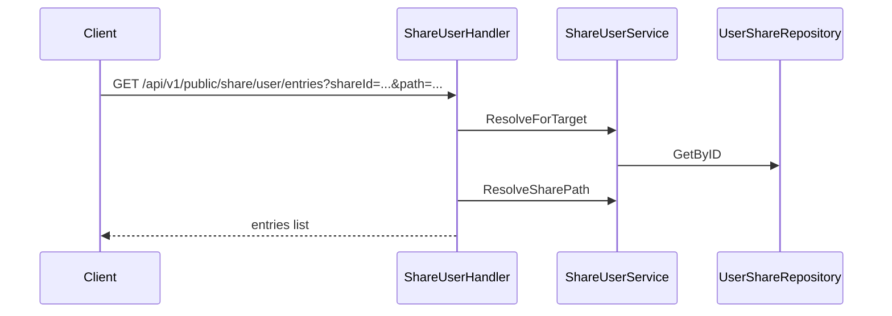

# 分享与回收站设计

本文档只描述当前仓库里“公开分享 / 站内共享 / 回收站”的已实现行为与运行流程。

## 文档边界

以下内容不在本文重复展开：

- 站内共享后续要如何演进成更统一的产品模型：见 [共享能力演进方案.md](./共享能力演进方案.md)
- 具体接口请求体和响应体：见 [Warehouse OpenAPI](./openapi/README.md)
- active / standby 下共享目录文件变更如何复制：见 [容灾方案.md](./容灾方案.md) 与 [内部复制版备用节点设计.md](./内部复制版备用节点设计.md)

## 公开分享（Share）

### 创建流程

- 公开分享仅支持文件，不支持目录。
- `expiresIn` > 0 时生成过期时间。

### 访问流程

- `Range` 非首段请求不会增加计数，避免分片导致膨胀。

## 定向分享（Share User）

### 创建与权限

- 目标用户通过钱包地址匹配。
- 当前创建接口已统一支持 `targetMode=addresses/groups/all_users`。
- `permissions` 可包含 `read/create/update/delete`（或 `CRUD` 字符串）。
- 支持文件或目录分享。
- 创建共享时可以直接指定钱包地址，也可以选择共享分组并展开为成员受众。
- 三种受众模式的产品语义与后续模型演进，见 [共享能力演进方案.md](./共享能力演进方案.md)。

### 使用流程（示例）

- 下载、上传、创建目录、重命名、删除均会先校验对应权限位。

### 当前实现

- 创建接口固定使用 `targetMode + targetAddresses/groupIds`。
- 站内共享元数据统一落在 `internal_share_items + internal_share_audiences`。
- 公开链接元数据保存在 `share_items`；由收到的定向分享生成的公开链接通过 `source_share_id` 关联来源分享，但资源所有者仍记录在 `user_id`。
- 本文只确认“当前已经这样实现”，不继续展开为什么要使用这套模型。

### 资源删除与移动时的引用处理

分享当前仍然是路径型引用。资源通过 Warehouse 支持的写入口删除、移动或重命名后，服务端会统一维护定向分享和公开链接，不依赖前端先查询、再撤销分享。

删除文件或目录时：

- 删除路径完全相同的定向分享和公开链接。
- 删除目录时，同时删除目录下所有子路径对应的分享引用。
- 由收到的定向分享派生出的公开链接也会一并删除。
- 路径匹配以完整目录边界为准；删除 `/personal/snmp` 不会影响 `/personal/snmp_backup`。

移动或重命名文件、目录时：

- 更新根资源以及所有子路径的定向分享路径。
- 更新根资源以及所有子路径的公开链接路径，包括派生公开链接。
- 根资源改名时，同时更新分享记录显示名称。

当前统一处理覆盖以下入口：

- WebDAV `DELETE`、`MOVE`，包括删除到回收站和回退硬删除。
- S3 `DeleteObject`、`DeleteObjects`。
- 收到的定向分享中的 WebDAV `DELETE`、`MOVE`。
- 定向分享文件操作接口中的删除和重命名。

`COPY` 不改变源资源的分享引用，新副本也不会自动继承分享；覆盖上传因为逻辑路径不变，会保留已有分享引用。

文件系统变更和 PostgreSQL 分享元数据更新分属两个存储，目前不是跨存储事务。若文件系统被 Warehouse 之外的程序直接修改，服务端无法实时拦截，仍可能产生历史悬空记录；此类记录需要通过撤销分享或后续对账清理能力处理。

### 升级注意事项

- 升级前请确认数据库账号具备 `CREATE/ALTER/INDEX` 权限，启动时会执行表结构迁移。
- 如果旧库里存在 `share_user_items`，升级启动会自动幂等导入到 `internal_share_*`，不需要手工触发。
- 升级后创建接口只接受新请求体（`targetMode + targetAddresses/groupIds`），旧 `targetAddress` 调用需要改造客户端。
- 建议升级后抽样检查：`internal_share_items` 与 `internal_share_audiences` 是否有历史数据。

## 回收站

### 写入回收站（由 WebDAV DELETE 触发）

- WebDAV 删除会尝试把文件移动到 `.recycle` 目录。
- 同时写入 `recycle_items`，记录 hash/路径/大小/删除时间。
- 资源离开有效资产路径后，对应定向分享和公开链接立即删除。

### 恢复/清理

- `recover`：将回收站文件移动回原路径，若原路径已存在则失败。
- `permanent`：删除回收站文件并移除记录。
- `clear`：批量清空。
- 恢复资源不会自动恢复删除前的分享关系；需要由资源所有者重新创建分享。

### 文件命名策略

- 新规则：`{hash}_{原文件名}`
- 兼容旧规则：`{username}_{directory}_{name}_{timestamp}`

## 与 Standby 的关系

- 共享元数据（公开分享、站内共享、受众）都存储在 PostgreSQL，active/standby 共享同一数据库时可直接一致读取。
- 共享目录内的上传、重命名、删除仍走文件系统变更路径，并通过复制 outbox / internal replication 同步到 standby。
- 因此本次站内共享模型演进不会绕开现有 standby 复制链路。
