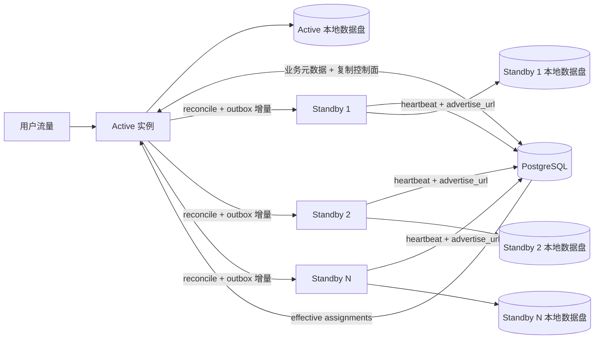
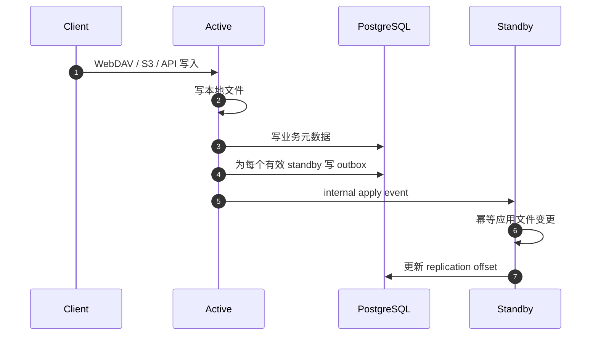

# 多副本方案

本文合并原来的 active/standby、内部复制备用节点、容灾和多实例路线内容，作为 Warehouse 多副本相关的唯一设计入口。部署命令和操作步骤仍以 [部署手册.md](./部署手册.md) 为准。

## 当前结论

| 阶段 | 状态 | 结论 |
| --- | --- | --- |
| V1 | 已有基础 | `1 active + N standby`，active 对外服务，standby 只接 internal 复制 |
| V2 | 下一阶段 | 补齐自动自愈、周期性对账、漂移修复、限流和观测 |
| V3+ | 远期 | 共享存储或对象存储化，应用副本逐步无状态化 |

当前项目的核心元数据已经集中在 PostgreSQL，但文件内容、WebDAV 锁、challenge、邮箱验证码等仍有单机依赖。因此当前不能把多个副本同时放到 LB 后面承接用户写流量。

## V1 拓扑

## V1 运行规则

- active 对外提供 `public` / `admin` 流量。
- standby 不接用户流量，只接实例间 `internal` 同步流量。
- 每个实例各自使用本地 `webdav.directory`。
- 元数据以 PostgreSQL 为准。
- 每个实例通过 `node.advertise_url` 和 `cluster_nodes` 上报心跳。
- active 在 `cluster_replication_assignments` 中为健康 standby 维持有效 assignment。
- active 每次文件变更会按有效 standby fan-out 生成 outbox 事件。
- startup reconcile 和后续增量复制共同保证 standby 追随 active。

## 控制面与复制面

| 表 | 层次 | 回答的问题 |
| --- | --- | --- |
| `cluster_nodes` | 节点发现 | 当前有哪些节点在线、internal 地址是什么 |
| `cluster_replication_assignments` | 编排控制 | 当前哪个 active 正式复制给哪个 standby、处于哪一代 |
| `replication_outbox` | 增量分发 | 哪些文件变更事件需要发送给哪个 standby |
| `replication_offsets` | 复制进度 | 某个 standby 已经应用到哪个 outbox 序号 |
| `replication_reconcile_jobs` / `replication_reconcile_items` | 历史补齐 | 哪些历史文件需要补齐、状态如何 |

## 复制链路

## 事件覆盖范围

V1 复制至少覆盖这些文件系统写入口：

- WebDAV `PUT` / `MKCOL` / `MOVE` / `COPY` / `DELETE`
- 回收站 `recover` / `permanent` / `clear`
- 站内共享目录下的上传、建目录、重命名、删除
- S3 删除和覆盖写入相关路径维护

## 当前边界

V1 不是完整多副本：

- 不支持多个 active 同时接用户写流量。
- 不支持自动 promote / 自动 failover。
- 不支持自动 rebalance。
- 自动 reconcile 还不是完整周期性全量对账。
- PostgreSQL 自身仍需要主备、PITR 或托管高可用保障。
- 本地文件目录仍需要独立备份策略。

## 方案取舍

| 方案 | 结论 | 原因 |
| --- | --- | --- |
| 单活 + N standby + internal 增量同步 | 当前采用 | 适配本地文件目录，应用可观测复制状态 |
| 外部 rsync / 块复制 | 备选 | 改代码少，但应用内不可观测、切换判断依赖外部系统 |
| 多副本 + 粘性会话 | 不建议作为正式方案 | 不能解决 WebDAV 锁和进程内临时状态问题 |
| 共享 POSIX 存储 + 外置临时状态 + 无状态副本 | 正式目标 | 支持滚动发布和横向扩展 |
| 对象存储化 / 存储抽象重构 | 中长期 | 可扩展性更好，但改造范围最大 |

## V2 待补齐

- 自动 failover / promote 前置检查。
- 周期性 reconcile 和漂移修复。
- 多 standby 下的 reconcile 并发控制和带宽限流。
- 单 standby 异常时的资源隔离与退避。
- 复制状态、lag、last error 和 assignment 的告警规则。
- 切换前检查和切换后回滚路径的稳定化。

## 运维入口

多副本部署、升级、回滚、切换和排障命令统一维护在 [部署手册.md](./部署手册.md)。本文不重复命令，只解释方案。
