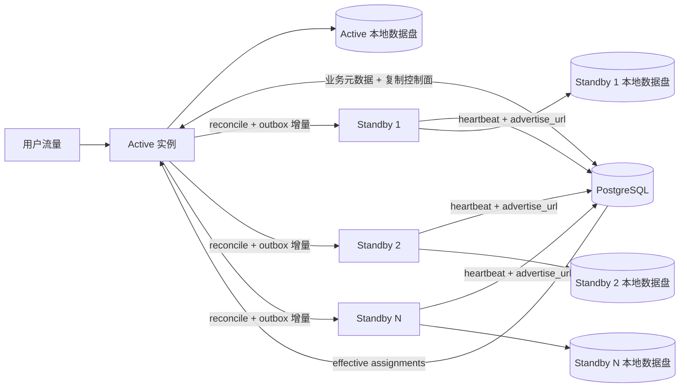
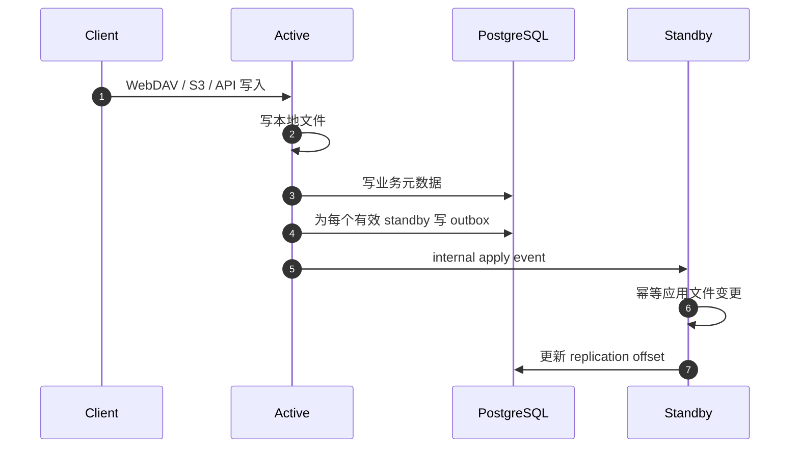

# 多副本方案

本文合并原来的 active/standby、内部复制备用节点、容灾和多实例路线内容，作为 Warehouse 多副本相关的唯一设计入口。部署命令和操作步骤仍以 [部署手册.md](./部署手册.md) 为准。

## 当前结论

| 阶段 | 状态 | 结论 |
| --- | --- | --- |
| V1 | 已有基础 | `1 active + N standby`，active 对外服务，standby 只接 internal 复制 |
| V2 | 当前收敛 | 补齐自动自愈、周期性对账、漂移修复、限流、观测和人工切换 SOP |
| V3+ | 远期 | 共享存储或对象存储化，应用副本逐步无状态化 |

当前项目的核心元数据已经集中在 PostgreSQL，但文件内容、WebDAV 锁、challenge、邮箱验证码等仍有单机依赖。因此当前不能把多个副本同时放到 LB 后面承接用户写流量。

## V1 拓扑

## V1 运行规则

- active 对外提供 `public` / `admin` 流量。
- standby 不接用户流量，只接实例间 `internal` 同步流量。
- 每个实例各自使用本地 `webdav.directory`。
- 元数据以 PostgreSQL 为准。
- 每个实例通过 `node.advertise_url` 和 `cluster_nodes` 上报心跳。
- active 在 `cluster_replication_assignments` 中为健康 standby 维持有效 assignment。
- active 每次文件变更会按有效 standby fan-out 生成 outbox 事件。
- startup reconcile 和后续增量复制共同保证 standby 追随 active。

## 控制面与复制面

| 表 | 层次 | 回答的问题 |
| --- | --- | --- |
| `cluster_nodes` | 节点发现 | 当前有哪些节点在线、internal 地址是什么 |
| `cluster_replication_assignments` | 编排控制 | 当前哪个 active 正式复制给哪个 standby、处于哪一代 |
| `replication_outbox` | 增量分发 | 哪些文件变更事件需要发送给哪个 standby |
| `replication_offsets` | 复制进度 | 某个 standby 已经应用到哪个 outbox 序号 |
| `replication_reconcile_jobs` / `replication_reconcile_items` | 历史补齐 | 哪些历史文件需要补齐、状态如何 |

## 复制链路

## 事件覆盖范围

V1 复制至少覆盖这些文件系统写入口：

- WebDAV `PUT` / `MKCOL` / `MOVE` / `COPY` / `DELETE`
- 回收站 `recover` / `permanent` / `clear`
- 站内共享目录下的上传、建目录、重命名、删除
- S3 删除和覆盖写入相关路径维护

## 当前边界

V1 不是完整多副本：

- 不支持多个 active 同时接用户写流量。
- 不支持自动 promote / 自动 failover。
- 不支持自动 rebalance。
- 自动 reconcile 还不是完整周期性全量对账。
- PostgreSQL 自身仍需要主备、PITR 或托管高可用保障。
- 本地文件目录仍需要独立备份策略。

## 方案取舍

| 方案 | 结论 | 原因 |
| --- | --- | --- |
| 单活 + N standby + internal 增量同步 | 当前采用 | 适配本地文件目录，应用可观测复制状态 |
| 外部 rsync / 块复制 | 备选 | 改代码少，但应用内不可观测、切换判断依赖外部系统 |
| 多副本 + 粘性会话 | 不建议作为正式方案 | 不能解决 WebDAV 锁和进程内临时状态问题 |
| 共享 POSIX 存储 + 外置临时状态 + 无状态副本 | 正式目标 | 支持滚动发布和横向扩展 |
| 对象存储化 / 存储抽象重构 | 中长期 | 可扩展性更好，但改造范围最大 |

## V2 收敛项

- 自动 reconcile、自愈和漂移修复。
- 多 standby 下的 reconcile 并发控制和带宽限流。
- 单 standby 异常时的资源隔离与退避。
- 复制状态、lag、last error 和 assignment 的观测入口。
- 人工切换 SOP 的切换前检查、旧 active 隔离、standby 提升、旧 active 回归和回滚边界。

## V2 Reconcile 自愈方案

Reconcile 是 active 向 standby 补齐历史文件的自愈入口。V2 阶段先不做正式多活，也不引入复杂的外部编排，重点是让 `1 active + N standby` 在 standby 中断、重启或长时间落后后可以自动追上，或者进入明确可处理的失败状态。

### 扫描边界

Reconcile 扫描只处理用户和服务可见的资产数据，不处理 Warehouse 内部运行态对象：

| 路径 / 文件 | 处理方式 | 原因 |
| --- | --- | --- |
| `.recycle/` | 跳过整棵目录 | 回收站对象由删除、恢复、永久删除事件维护，不作为普通历史资产补齐 |
| `.warehouse-uploads/` | 跳过整棵目录 | 浏览器断点上传会话是运行态，不应复制为用户资产 |
| `.s3-multipart/` | 跳过整棵目录 | S3 Multipart staging 是未完成对象的临时状态 |
| `._upload-*` | 跳过 | 原子写入临时文件，不代表稳定对象 |
| `.warehouse-repl-*` / `.warehouse-copy-*` | 跳过 | standby apply 过程中的临时文件 |
| `*.tmp` / `*.tmp.reconcile` | 跳过 | 分片、session 和 reconcile 写入过程中的临时文件 |
| apps 下 `backup.__sync_*` | 跳过 | chat / WebDAV 同步内部对象已有硬删除和增量复制边界，不应污染历史补齐 |

这条边界必须和增量复制保持一致：增量 outbox 不记录的临时对象，reconcile 也不应该重新扫出来。历史版本已经进入 `.recycle` 的 sync 对象，使用 `warehouse recycle clean-sync-artifacts` 清理。

### 自动恢复状态机

| 状态 | 自动行为 | 人工介入 |
| --- | --- | --- |
| assignment `pending` | 自动启动 reconcile | 通常不需要 |
| assignment `reconciling` + running job | 恢复未完成 job，继续发送 pending items | 长时间无进展时查看日志和状态接口 |
| assignment `replicating` 但 offset 缺失 | 自动重新 reconcile 并 bootstrap mark | 确认 standby 磁盘和 internal 地址可用 |
| generation mismatch | 自动重新 reconcile 当前 generation | 检查 active / standby assignment 是否一致 |
| 连续失败超过阈值 | assignment 自动进入 `paused` | 修复网络、鉴权、磁盘或配置后执行 `resume` |

### 失败分类与重试

V2 保留现有 assignment 级重试和自动暂停模型，先不引入 item 级复杂状态机：

- 扫描失败：通常是 active 本地目录权限、磁盘或路径问题，记录到 reconcile job 和 assignment。
- 发送失败：通常是 standby internal 地址、shared secret、网络或 standby 磁盘问题，按 assignment 退避重试。
- apply 失败：通常是 standby 落盘、路径安全校验或 generation 校验问题，保留失败详情供排障。
- 长期失败：达到 `replication.reconcile_auto_pause_failures` 后自动暂停，避免无限重试拖垮 active。

### V2 代码落地顺序

1. 固化 scanner 系统对象跳过规则，减少无效传输和漂移来源。
2. 补足状态接口中 reconcile / assignment 的解释字段。
3. 增加 generation 和历史 job / item 清理策略。
4. 再补多 standby 并发和带宽限流。
5. 最后固化人工切换 SOP，明确旧 active 隔离、standby 提升、旧 active 回归和回滚边界。

## 多 Standby Reconcile 并发与限流

V2 只控制 active 侧的历史补齐资源，不改变 standby 只接 internal 流量的拓扑。默认保持保守：同一 active 同时只跑 1 个 reconcile，带宽不限；多 standby 场景需要运维显式调大。

| 配置 | 默认值 | 含义 |
| --- | --- | --- |
| `replication.reconcile_max_concurrency` | `1` | active 自动 sweep 和手工 reconcile 共享的最大并发数 |
| `replication.reconcile_bandwidth_limit_bytes_per_second` | `0` | active 发送 reconcile batch 的全局出站速率上限，`0` 表示不限速 |

调度规则：

- periodic auto reconcile 会先判断每个 standby 是否需要补齐，再按并发上限执行。
- 手工 `ha reconcile start` 和自动 reconcile 共用同一个并发闸门，避免人工操作绕过资源保护。
- 一个 standby 失败只记录到该 standby 对应 assignment，不阻塞其他 standby 的补齐任务。
- 带宽限制只作用于 reconcile 历史补齐 batch，不影响普通用户流量、WebDAV/S3 写入和 outbox 增量复制。

限流是 active 进程内的全局令牌式节流。它不追求精确网络 QoS，只用于避免多个 standby 同时补历史时把 active 的磁盘、CPU 和出口带宽打满。需要更强的网络治理时，应在部署层继续配合 Nginx、tc 或云厂商带宽策略。

## Generation 生命周期与历史保留

Generation fence 只能保证新旧 assignment 不串扰，不会自动清理历史记录。V2 对复制数据采用“当前代际强保护、明细短保留、摘要长保留”的策略。

| 数据 | 默认保留 | 清理边界 |
| --- | --- | --- |
| `replication_reconcile_items` | 7 天 | 只清理已结束 job 的 item；`running` job 的 pending / failed item 一律保留 |
| `replication_reconcile_jobs` | 30 天 | 不删除 `running` job，不删除 assignment 当前引用的 `last_reconcile_job_id`，每个 source / target / generation 至少保留最新一条摘要 |
| `replication_outbox` | 7 天 | 只清理已不属于任何当前有效 assignment generation 的事件；当前 generation 的 pending / failed / dispatched 事件全部保留 |
| `replication_offsets` | V2 不自动删除 | 单对 source / target 只有一条摘要，体量小；保留用于切换排障，等 V3 assignment 归档一起治理 |
| `cluster_replication_assignments` | V2 不自动删除 | 属于控制面审计记录，必须在正式归档方案完成后再裁剪 |

清理必须在单个数据库事务中执行，并按 item、job、outbox 的顺序处理。自动任务只在 replication 启用的 active 节点运行，standby 不参与数据库清理，避免多节点重复执行。保留期和执行周期由 `replication` 配置控制；关闭自动清理时，不影响复制主链路。

## 运维入口

多副本部署、升级、回滚、切换和排障命令统一维护在 [部署手册.md](./部署手册.md)。本文不重复命令，只解释方案。
