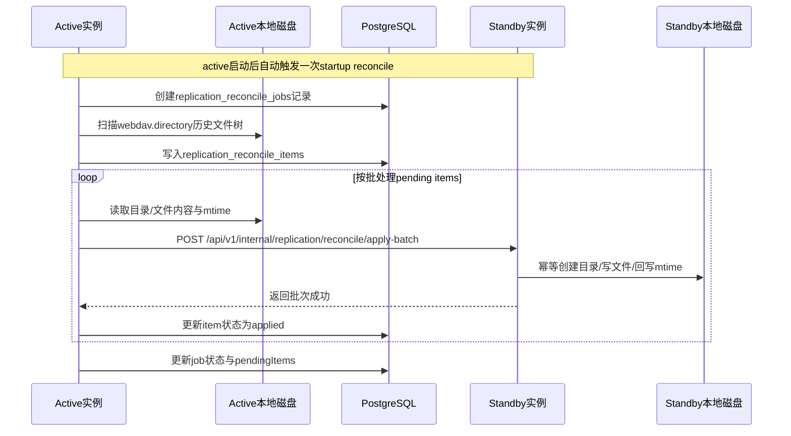
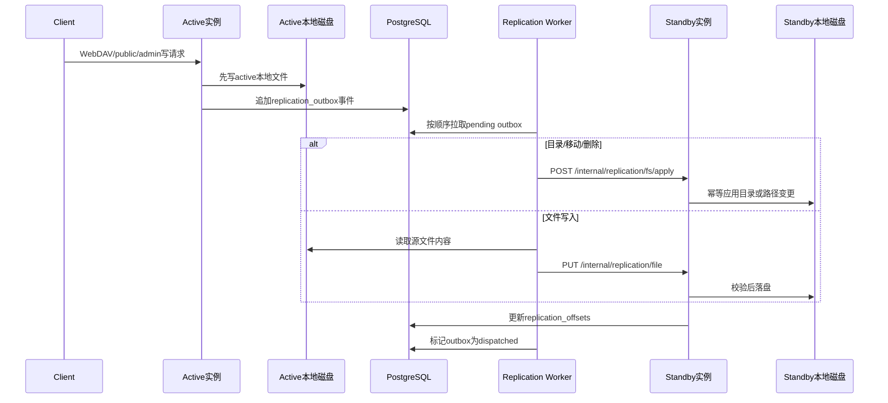

# 容灾方案

> 本文记录当前仓库在容灾/高可用上的选定路线、已经实现的能力、明确边界、常见 QA 与待办事项。  
> 任何复制、自愈、切换、恢复逻辑变更后，都应同步更新本文。

## 1. 当前选定路线

当前代码的阶段一容灾/高可用路线是：

- `1 active + 1 standby`
- active 对外提供 `public` / `admin` 流量
- standby 不接用户流量，只接实例间 `internal` 同步流量
- active / standby 各自使用本地 `webdav.directory`
- 文件数据通过应用内 `internal` 同步保持双份
- 元数据以 PostgreSQL 为准
- standby 的 `internal.replication.peer_base_url` 可以为空
- active 启动后会自动触发一次历史 reconcile
- 日常文件变化继续通过 outbox 增量复制追平

这是一种单活双机方案，不是正式多副本负载均衡方案。

## 2. Active / Standby 时序图

### 2.1 启动后的历史补齐

### 2.2 日常增量复制

## 3. 当前已经实现

- [x] active / standby 节点身份配置
- [x] internal HMAC 鉴权
- [x] `replication_outbox` / `replication_offsets`
- [x] active 侧增量复制 worker
- [x] standby 侧文件/目录幂等 apply
- [x] `replication_reconcile_jobs` / `replication_reconcile_items`
- [x] active 启动后自动触发一次历史 reconcile
- [x] 手工触发 `POST /api/v1/internal/replication/reconcile/start`
- [x] standby 批量接收历史文件 `POST /api/v1/internal/replication/reconcile/apply-batch`
- [x] 历史同步保留文件 `mtime`
- [x] `GET /api/v1/internal/replication/status` 暴露复制与 reconcile 状态
- [x] `scripts/bootstrap_standby.sh` 可用于显式 baseline / 状态查询

## 4. 当前真实边界

下面这些限制是当前代码的真实状态，文档需要明确反映，不能假设已经解决：

- 当前只支持 `1 active -> 1 standby`
- 当前没有多 standby 扇出能力
- 当前的自动历史补齐只发生在 active 启动后
- 当前 startup reconcile 的自动重试为 24 次、每次间隔 5 秒，约 2 分钟窗口
- standby 单独重启不会自动重新触发一次完整历史 reconcile
- 当前没有周期性 reconcile worker
- 当前没有“失败 job 自动持续恢复直到成功”的后台调度器
- 当前 reconcile 是“active 全量重扫 + 直接重推”，不是差异对账后只补缺口
- 当前 reconcile 下发文件内容使用批量 JSON + base64，功能可用，但不适合超大历史数据集
- 当前双本地盘双份不等于备份，仍然需要外部备份与恢复演练

## 5. 自愈能力说明

### 4.1 增量复制路径

- standby 临时不可用时，outbox 会积压
- standby 恢复后，增量复制可以继续追平
- 这部分自愈能力相对稳定，因为 outbox / offsets 是持久化的

### 4.2 历史补齐路径

- active 启动时会尝试自动跑一次历史 reconcile
- 自动 reconcile 带有限重试窗口，不是无限后台任务
- 当前代码的重试窗口约为 2 分钟
- 如果 standby 在该窗口内恢复，可继续完成历史补齐
- 如果 standby 恢复晚于该窗口，历史缺口不会无限自动重试
- 这类场景目前需要手工触发 `reconcile/start`，或重启 active 再触发一次 startup reconcile

## 6. Standby QA

### 6.1 支持多少个 standby 实例

当前只支持 1 个 standby。

原因是现有配置和 worker 都是单目标模型，只存在一组：

- `internal.replication.peer_node_id`
- `internal.replication.peer_base_url`

### 6.2 standby 在同步历史数据时断电重启，能否自愈

可以部分自愈，但不是绝对自动。

- 如果 standby 在 active 启动后的自动 reconcile 重试窗口内恢复，通常可以继续完成
- 如果超过该窗口，历史缺口不会继续无限自动补齐
- 当前需要手工触发一次 `reconcile/start`，或重启 active 重新触发 startup reconcile

### 6.3 standby 一段时间没有工作，重新启动，能不能自愈

要分两类：

- 增量变更：通常可以继续追平
- 历史缺口：当前不保证仅靠 standby 自己重启就能自动修复

如果 standby 长时间离线后回来，而 active 没有重启，也没有手工触发 reconcile，那么：

- 新增量事件会继续走 outbox 复制
- 旧历史缺口不一定会自动补齐

### 6.4 standby 对 active 的影响控制

当前复制是异步的，不阻塞用户主写请求，这是当前方案的核心优点。

但 standby 仍会影响 active 的资源消耗：

- 数据库写入 outbox 的压力
- active 本地磁盘扫描与读盘压力
- 历史文件传输带来的网络占用
- 大量历史文件补齐时的 CPU / 内存消耗

当前已经做到“不阻塞主链路”，但还没有做到“精细限流”。

### 6.5 还有哪些工作可以继续优化

优先级建议如下：

- [ ] 多 standby 扇出能力
- [ ] 周期性 reconcile，不只依赖 active 启动时的一次补齐
- [ ] 失败 reconcile job 自动恢复 / 持续重试
- [ ] 差异对账式 reconcile，而不是全量重推
- [ ] 大文件历史同步改为流式 / 分片，不再使用 base64 JSON
- [ ] reconcile 限流、并发、批大小、带宽控制
- [ ] 复制与补齐的指标、日志、告警
- [ ] 切换自动化：fencing / promote / 回切 SOP
- [ ] reconcile 表清理与历史审计策略

## 7. 运维建议

### 7.1 当前推荐操作方式

- active 放在 LB 上游
- standby 只暴露 internal，不对外接 public/admin
- 切换前同时检查 readiness、replication status、reconcile status
- 优先使用 `build/warehouse ha ...` 作为运维入口，而不是手工 `curl` 或签名脚本
- 如果要显式控制基线，可使用 `build/warehouse ha bootstrap mark ...`
- 如果要修复历史缺口，优先使用 `build/warehouse ha reconcile start ...`

### 7.2 当前不应误判为已具备的能力

- 不能把“有 standby”理解成“已经等价于完整灾备”
- 不能把“双本地盘双份”理解成“已经有备份”
- 不能把“standby 能追增量”理解成“所有历史缺口都能自动无限自愈”

## 8. 仍需外部保障的部分

即使应用内 active / standby 已经工作，仍然建议运维层继续做：

- PostgreSQL 主备或 PITR
- 文件异地备份
- 备份保留策略
- 定期恢复演练
- 存活、磁盘、复制状态告警

## 9. 当前待办清单

### 9.1 应用内待办

- [ ] 多 standby 复制拓扑
- [ ] 周期性 reconcile 调度器
- [ ] 启动后未成功 job 的恢复执行器
- [ ] reconcile 差异比较与跳过逻辑
- [ ] 大文件流式历史补齐
- [ ] 复制/补齐限流与背压
- [ ] 切换编排与自动化
- [ ] 用正式 CLI 完整替代 `scripts/bootstrap_standby.sh` 这类运维脚本

### 9.2 运维待办

- [ ] PostgreSQL 高可用或 PITR
- [ ] 文件异地备份
- [ ] 恢复演练与 RPO / RTO 记录
- [ ] 复制 lag / reconcile 失败告警

## 10. 文档维护约定

以下改动发生时，必须同步更新本文：

- standby 自愈策略改变
- reconcile 触发方式改变
- 多 standby 能力落地
- 切换流程改变
- 备份 / 恢复 / 演练策略改变
